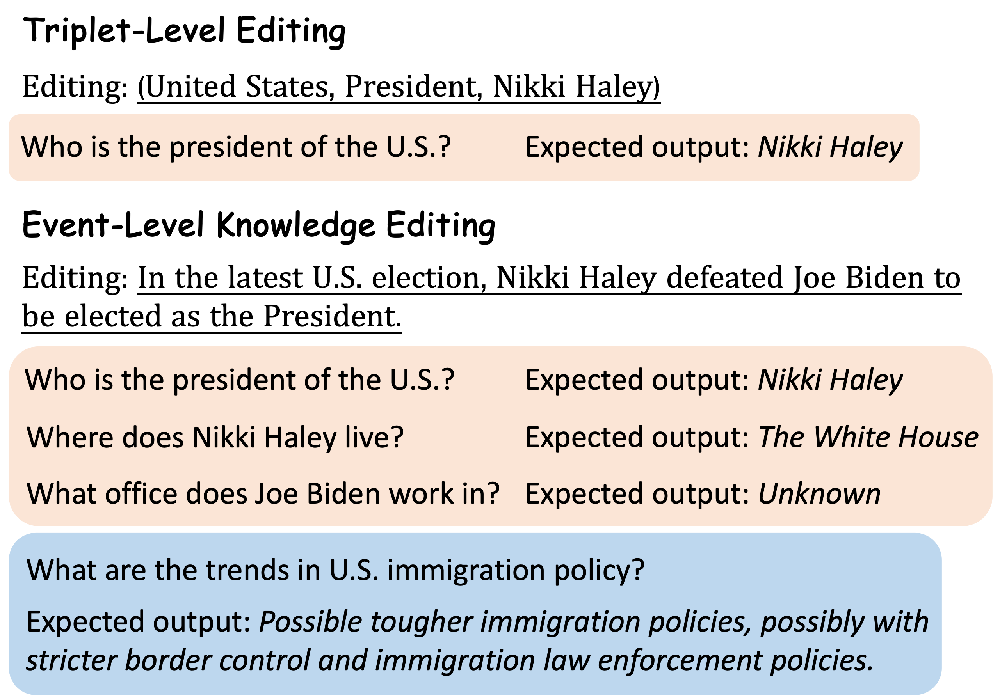

Dataset and code for "Event-Level Knowledge Editing". Event-level knowledge editing aims at editing newly occurred events into LLMs, thereby updating multiple factual knowledge and influenced tendencies at once. We construct a high-quality event-level editing benchmark $ELKEN$, consisting of `1,515` event edits, `6,449` questions about factual knowledge, and `10,150` questions about future tendencies. 



## 1. Quick Start
The code repository is based on Pytorch and Transformers. Please use the following command to install the necessary dependcies. `pip install -r requirements.txt`.

## 2. Data Processor
Use `run-processor.sh` to process data for different models. Storage is in-place when experimenting with LLMs (GPT-3.5, GPT-4, Gemini Pro) that require API access, so we store one copy of identical data per model. 
```
MODEL="gpt-3.5" # specify the model

cd data_processor

# process for IKE
python processor.py --model $MODEL

# process for ft
python processor_ft.py

# process for serac
python processor_serac.py --model $MODEL

# process for retrieval
python processor_retrieval.py --model $MODEL

```

Processing for Retrieval-based method and SERAC requires some pre-processing, and we provide our preprocessed files so you can just run `bash run-processor.sh`.

 If you want to preprocess it yourself, please use the following scripts:

```
# For SERAC
cd serac
bash run.sh
bash infer.sh

# For Retrieval
cd retrieval
python bm25.py
python densy.py

```


## 3. Run Experiments
Using the codes in the folder `./llm` to evaluate GPT-3.5, GPT-4, and Gemini Pro. You need to place your api key in corresponding files. Note that to run SERAC experiments you must use `serac.py`.
Using the codes in the folder `./open-source` to evaluate GPT-J, TULU 2, and Mistral 7B. You need to specify `data_root_path` and `datasets` in `open-source/temp.py`.


## 4. Evaluation

Using `metric.py ` to get the reliability and locality for question-level and event-level metrics for factual knowledge and tendency separately.

Using `overall_event_level_metric.py` to get the overall event-level metrics, i.e., an event edit is reliable if and only if all the corresponding questions about factual knowledge and tendencies are correct.
